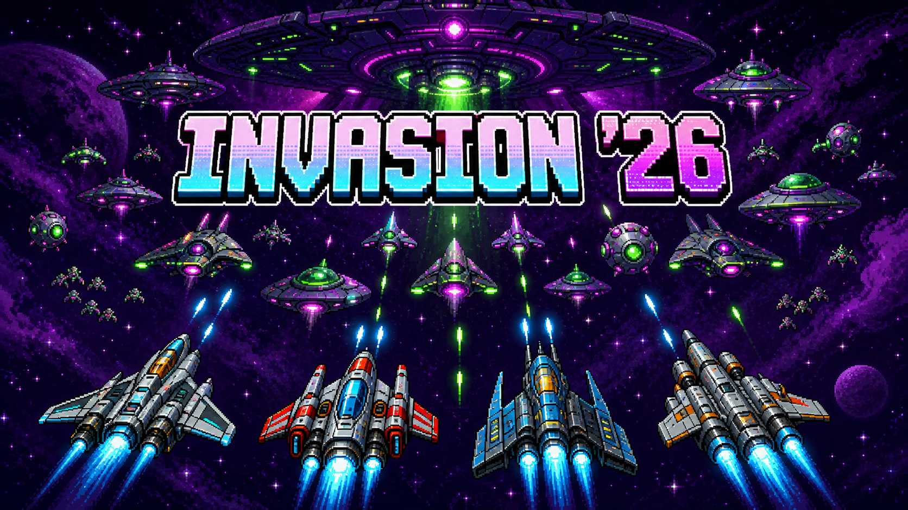

# Galaga Multiplayer

Galaga Multiplayer es un experimento de videojuego arcade para navegador: una partida cooperativa inspirada en los shooters clasicos de naves, donde un jugador crea una sala y comparte un link para que otras personas se sumen al instante.



La idea central es que jugar sea tan simple como abrir una URL:

```text
Crear partida -> compartir link -> entrar al lobby -> jugar
```

## Idea del Proyecto

El objetivo es construir un shooter 2D multiplayer en tiempo real, con partidas cortas, controles simples y foco en la experiencia de jugar con amigos sin instalacion previa.

El juego toma como referencia la energia arcade de Galaga: naves, oleadas de enemigos, disparos, puntaje y dificultad progresiva. No busca copiar assets, nombres, audio ni contenido propietario del juego original; la direccion es crear una version propia inspirada en ese tipo de experiencia.

## Experiencia Esperada

- Un jugador crea una sala desde el navegador.
- El sistema genera un link unico de invitacion.
- Otros jugadores abren el link y entran al lobby.
- El host inicia la partida.
- Los jugadores controlan sus naves en una misma pantalla sincronizada.
- El equipo sobrevive oleadas de enemigos y acumula puntaje.
- La partida termina cuando todos pierden sus vidas.

## Stack Previsto

- **Godot 4.7** para el cliente del juego.
- **Export Web** para correr en navegador con HTML5/WebAssembly.
- **Backend HTTP + WebSocket** para salas, lobby y sincronizacion realtime.
- **Netlify** como posible hosting del cliente web.
- **Railway, Fly.io, Render o VPS** como posible hosting del backend multiplayer.

## Arquitectura Inicial

El proyecto esta pensado como monorepo:

## Estructura

```text
game/       Proyecto Godot
backend/    API HTTP + WebSocket para salas y partidas
shared/     Contratos/protocolo compartido
docs/       Specs y decisiones tecnicas
```

El cliente Godot se encargara de renderizar el juego, capturar inputs y mostrar el estado de la partida. El backend sera la fuente autoritativa para salas, jugadores, enemigos, oleadas, score y eventos de partida.

## Estado

Proyecto en etapa inicial de especificacion y setup.

Actualmente incluye:

- Proyecto base de Godot.
- Spec inicial del producto y arquitectura.
- Estructura monorepo preparada para cliente, backend y contratos compartidos.
- Backend base con HTTP, WebSocket, lint, typecheck, tests y coverage 100% para logica testeable.
- Home screen de Godot con estilo arcade retro.
- Creacion de sala desde Godot via `POST /api/rooms`.
- Join inicial al lobby desde Godot via `WS /ws/rooms/{roomId}` y mensaje `join_room`.

## Desarrollo Local

Requisitos:

- Node.js 24+
- npm 11+

Instalar dependencias:

```bash
npm install
```

Ejecutar checks:

```bash
npm run lint
npm run typecheck
npm run coverage
```

Levantar backend local:

```bash
npm run dev --workspace backend
```

Abrir Godot:

```bash
godot --editor --path game
```

Ejecutar el proyecto Godot:

```bash
godot --path game
```

Endpoints iniciales:

```text
GET  /health
POST /api/rooms
GET  /api/rooms/{roomId}
WS   /ws/rooms/{roomId}
```

Flujo local implementado:

```text
START ROOM -> POST /api/rooms -> WS /ws/rooms/{roomId} -> join_room -> room_state
```

## Roadmap Inicial

1. Crear el flujo de sala compartible.
2. Implementar lobby con lista de jugadores.
3. Conectar cliente Godot con backend WebSocket.
4. Sincronizar naves de varios jugadores.
5. Agregar enemigos, disparos, score y game over.
6. Exportar el cliente web y probar una partida real desde dos navegadores.

## Documentacion

- [Spec inicial](docs/spec.md)
- [Milestones](docs/milestones.md)
- [Spec de errores de lobby](docs/lobby-error-handling-spec.md)
- [Spec Ready / Start](docs/ready-start-spec.md)
- [Spec Game Scene Placeholder](docs/game-scene-placeholder-spec.md)
- [Principios de ingenieria](docs/engineering-principles.md)
- [Pipeline de arte](docs/art-pipeline.md)
- [Protocolo multiplayer](shared/protocol.md)
